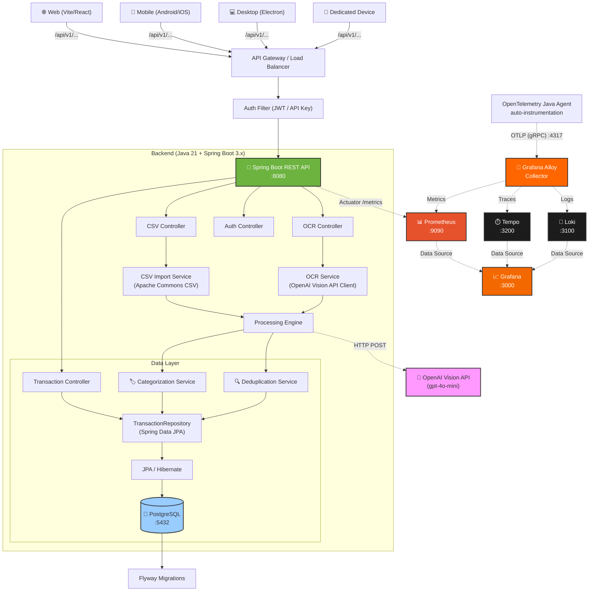
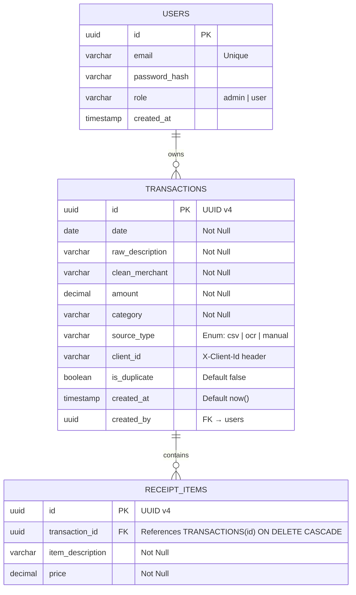

# Architecture Plan: CSV + Receipt OCR Finance Tracker

> **Author:** Architecture Designer  
> **Status:** Draft — Review Pending  
> **Version:** 3.0.0 (Observability + Multi-Client)

---

## 1. Requirements Summary

### 1.1 Functional Requirements

| ID | Requirement | Priority |
|----|-------------|----------|
| F1 | Upload CSV bank statements and parse transaction rows | P0 |
| F2 | Upload receipt photos and extract merchant, date, amount, line items via OCR | P0 |
| F3 | Automatically map variable bank CSV column headers to a unified schema | P0 |
| F4 | Auto-categorize transactions (e.g., "Coffee Shop", "Transportation") | P1 |
| F5 | Deduplicate transactions within a 2-day window (same date + amount) | P1 |
| F6 | Show a preview grid for user review, edit, and confirmation before saving | P0 |
| F7 | Store transactions and receipt line items in a database | P0 |
| F8 | Support manual transaction entry (fallback) | P2 |
| F9 | **Serve multiple frontend clients** — web (Vite/React), mobile (Android/iOS), desktop (Electron/Tauri), dedicated devices | P1 |
| F10 | **Expose OpenAPI/Swagger documentation** for third-party client consumption | P1 |

### 1.2 Non-Functional Requirements

| Category | Requirement |
|----------|-------------|
| **Performance** | OCR < 5s; CSV < 2s for 10K rows; API p95 < 200ms |
| **Scalability** | Multi-user; PostgreSQL handles concurrent access |
| **Availability** | 99.9% via Docker Compose self-hosting or cloud |
| **Security** | JWT authentication; API key auth for devices; CORS per origin |
| **Privacy** | Receipt images sent to Vision API must not be retained |
| **Observability** | **OpenTelemetry tracing + metrics + logs via Grafana stack** |
| **Maintainability** | Modular monolith; Flyway migrations; versioned API |
| **Multi-Client** | **API versioning (`/api/v1/`); consistent error contract; client identification** |
| **Cost** | Low infra — single VM or Docker host; pay-per-token for OCR |

### 1.3 Constraints

- **Team:** Solo developer / small team (1–3 people)
- **Timeline:** MVP in 8–10 weeks (incl. observability)
- **Budget:** Minimal — single VM or Docker Compose deployment
- **Backend Stack:** Java 21 + Spring Boot 3.x
- **Frontend Stack:** Vite + React + TypeScript + Tailwind CSS + shadcn/ui
- **Database:** PostgreSQL
- **Observability Stack:** OpenTelemetry → Grafana Alloy → Loki + Prometheus + Tempo → Grafana

---

## 2. Architecture Pattern: Modular Monolith

### Why Modular Monolith (Not Microservices)

| Pattern | Verdict | Rationale |
|---------|---------|-----------|
| **Monolith** | ✅ Base pattern | Single developer, simple domain, rapid iteration |
| **Modular Monolith** | ✅ **Recommended** | Clear module boundaries within a single deployable unit |
| **Microservices** | ❌ Over-engineered | 1–3 person team; no independent scaling needs |
| **Serverless** | ❌ Vendor lock-in | Higher complexity for a self-hosted tool |
| **Event-Driven** | ❌ Unnecessary | No async inter-service communication needed |

### Multi-Client Module Map

```
┌──────────────────────────────────────────────────────────────────────────┐
│                         Client Layer                                      │
│                                                                           │
│  ┌──────────────┐  ┌──────────────┐  ┌──────────────┐  ┌──────────────┐  │
│  │  Web (React) │  │  Mobile      │  │  Desktop     │  │  Dedicated   │  │
│  │  Vite SPA    │  │  Android/iOS │  │  Electron    │  │  Devices     │  │
│  └──────┬───────┘  └──────┬───────┘  └──────┬───────┘  └──────┬───────┘  │
│         │                  │                  │                  │         │
│         └──────────────────┼──────────────────┼──────────────────┘         │
│                            │                  │                            │
│                      ┌─────▼──────────────────▼─────┐                      │
│                      │       API Gateway / LB        │                      │
│                      │  (Nginx / Spring Cloud GW)   │                      │
│                      └─────┬──────────────────┬─────┘                      │
└────────────────────────────┼──────────────────┼────────────────────────────┘
                             │                  │
┌────────────────────────────┼──────────────────┼────────────────────────────┐
│                     ┌──────▼──────────────────▼──────┐                     │
│                     │   /api/v1/ (versioned)          │                     │
│                     │   X-Client-Id header            │                     │
│                     └──────┬──────────────────┬──────┘                     │
│                            │                  │                            │
│  ┌─────────────────────────▼──────────────────▼────────────────────────┐   │
│  │                    REST Controllers (API Layer)                      │   │
│  │  CsvController | OcrController | TransactionController | AuthCtl    │   │
│  └───────────────────────────────────┬─────────────────────────────────┘   │
│                                      │                                      │
│  ┌───────────────────────────────────▼─────────────────────────────────┐   │
│  │                     Service Layer (Business Logic)                   │   │
│  │  CsvImportService | OcrService | CategorizationService              │   │
│  │  DeduplicationService | TransactionService                          │   │
│  └───────────────────────────────────┬─────────────────────────────────┘   │
│                                      │                                      │
│  ┌───────────────────────────────────▼─────────────────────────────────┐   │
│  │                      Data Layer (Spring Data JPA)                    │   │
│  │  TransactionRepository | ReceiptItemRepository                      │   │
│  └───────────────────────────────────┬─────────────────────────────────┘   │
│                                      │                                      │
│                                      ▼                                      │
│                            ┌────────────────────┐                          │
│                            │    PostgreSQL       │                          │
│                            └────────────────────┘                          │
│                                                                           │
└───────────────────────────────────────────────────────────────────────────┘
```

---

## 3. Full Architecture Diagram (with Observability + Multi-Client)



---

## 4. Observability Architecture

### 4.1 Data Flow

```
┌──────────────────┐     ┌──────────────────┐     ┌──────────────────┐
│  Spring Boot App  │     │  Grafana Alloy   │     │  Storage Backend  │
│                   │     │  (Collector)     │     │                   │
│  OpenTelemetry    │────▶│                  │────▶│  Prometheus       │
│  Java Agent       │     │  - OTLP gRPC     │     │  (Metrics)        │
│                   │     │  - Batch Process │     │                   │
│  - Traces (HTTP)  │     │  - Multi-tenancy │────▶│  Tempo            │
│  - Metrics (JVM)  │     │  - Relabel       │     │  (Traces)         │
│  - Logs (app)     │     │  - Filter        │     │                   │
│  - DB queries     │     │                  │────▶│  Loki             │
│  - Vision API     │     │                  │     │  (Logs)           │
└──────────────────┘     └──────────────────┘     └──────────────────┘
                                                           │
                                                           ▼
                                                    ┌──────────────┐
                                                    │   Grafana    │
                                                    │  Dashboards  │
                                                    │  Explore     │
                                                    │  Alerts      │
                                                    └──────────────┘
```

### 4.2 What Gets Instrumented

| Component | Instrumentation | Tool |
|-----------|----------------|------|
| **HTTP Requests** | Incoming request tracing + duration | OpenTelemetry Java Agent |
| **Database Queries** | JDBC span per query + query text | OpenTelemetry JDBC Instrumentation |
| **Vision API Calls** | Outbound HTTP span + response time | OpenTelemetry HTTP Client |
| **JVM Metrics** | Heap, GC, threads, CPU | Micrometer + Prometheus |
| **Business Metrics** | CSV rows parsed, OCR success rate, duplicates found | Custom Micrometer counters |
| **Application Logs** | Structured JSON logs with trace ID | Logback + OTLP appender |
| **Database Logs** | Slow query log | PostgreSQL logging → Loki |

### 4.3 Grafana Alloy Configuration (Highlights)

```yaml
# Alloy processes: logs, metrics, traces via OTLP
receivers:
  otlp:
    protocols:
      grpc:
        endpoint: 0.0.0.0:4317
      http:
        endpoint: 0.0.0.0:4318

processors:
  batch:
    timeout: 1s
    send_batch_size: 1024

exporters:
  prometheus:
    endpoint: "prometheus:9090"
  otlp:
    endpoint: "tempo:4317"
    tls:
      insecure: true
  loki:
    endpoint: "loki:3100"
    tls:
      insecure: true

service:
  pipelines:
    traces:
      receivers: [otlp]
      processors: [batch]
      exporters: [otlp]
    metrics:
      receivers: [otlp]
      processors: [batch]
      exporters: [prometheus]
    logs:
      receivers: [otlp]
      processors: [batch]
      exporters: [loki]
```

### 4.4 Spring Boot Configuration

```yaml
# application.yml
management:
  endpoints:
    web:
      exposure:
        include: health, metrics, prometheus
  metrics:
    export:
      otlp:
        enabled: true
        url: http://alloy:4318/v1/metrics
  tracing:
    sampling:
      probability: 1.0   # 100% in dev; 10% in prod
    exporter:
      otlp:
        endpoint: http://alloy:4318/v1/traces

logging:
  pattern:
    level: "%5p [%X{traceId:-},%X{spanId:-}]"
  structured:
    format: logstash
```

### 4.5 Pre-built Grafana Dashboards

| Dashboard | Panels |
|-----------|--------|
| **Application Overview** | Request rate (RPS), error rate, p50/p95/p99 latency, active users |
| **JVM Health** | Heap memory, GC pauses, thread count, CPU usage |
| **Database** | Query count, slow queries (>100ms), connection pool usage |
| **OCR Pipeline** | OCR requests/min, success rate, avg latency, token cost |
| **Business KPIs** | Transactions imported/hour, duplicates detected, category distribution |
| **Tracing (Tempo)** | Distributed trace view per request, waterfall chart |

---

## 5. Multi-Client API Design

### 5.1 API Versioning Strategy

```
/api/v1/transactions     ← Current version
/api/v2/transactions     ← Future breaking changes
```

- Version is embedded in the URL path
- Backward-compatible changes (new fields, new endpoints) don't require version bump
- Breaking changes (renaming fields, changing types) require `/api/v2/`
- Old versions are deprecated with a `Sunset` header before removal

### 5.2 Client Identification

Every request must include a `X-Client-Id` header:

| Client | X-Client-Id | Auth Method | Rate Limit |
|--------|-------------|-------------|------------|
| Web (Vite/React) | `finance-tracker-web` | JWT (Bearer token) | 100 req/min |
| Mobile (Android/iOS) | `finance-tracker-mobile` | JWT (Bearer token) | 60 req/min |
| Desktop (Electron) | `finance-tracker-desktop` | JWT (Bearer token) | 100 req/min |
| Dedicated Device | `finance-tracker-device-{id}` | API Key (X-Api-Key) | 30 req/min |

### 5.3 Consistent Error Contract

```json
{
  "error": {
    "code": "VALIDATION_ERROR",
    "message": "Validation failed for field 'amount'",
    "details": [
      {
        "field": "amount",
        "rejectedValue": "-50.00",
        "reason": "must be greater than 0"
      }
    ],
    "traceId": "abc123def456",
    "timestamp": "2026-10-06T12:00:00Z"
  }
}
```

### 5.4 API Contract (v1)

| Method | Endpoint | Description | Request | Response |
|--------|----------|-------------|---------|----------|
| `POST` | `/api/v1/csv/parse` | Upload & parse CSV | `multipart/form-data` (file) | `List<ParsedTransactionDTO>` |
| `POST` | `/api/v1/ocr/process` | Upload receipt image | `multipart/form-data` (image) | `ParsedReceiptDTO` |
| `POST` | `/api/v1/transactions/batch` | Save confirmed transactions | `List<TransactionDTO>` | `List<Transaction>` |
| `GET` | `/api/v1/transactions` | List transactions (paginated) | Query params (page, size, sort, category, dateFrom, dateTo) | `Page<Transaction>` |
| `GET` | `/api/v1/transactions/{id}` | Get single transaction | Path variable | `Transaction` |
| `PUT` | `/api/v1/transactions/{id}` | Update transaction | JSON body | `Transaction` |
| `DELETE` | `/api/v1/transactions/{id}` | Delete a transaction | Path variable | `204 No Content` |
| `POST` | `/api/v1/auth/login` | User login | `{ email, password }` | `{ token, refreshToken }` |
| `POST` | `/api/v1/auth/refresh` | Refresh JWT | `{ refreshToken }` | `{ token, refreshToken }` |
| `GET` | `/api/v1/categories` | List available categories | — | `List<String>` |

### 5.5 CORS Configuration

```java
@Configuration
public class WebConfig implements WebMvcConfigurer {
    @Override
    public void addCorsMappings(CorsRegistry registry) {
        registry.addMapping("/api/v1/**")
            .allowedOrigins(
                "http://localhost:5173",           // Dev web
                "https://app.finance-tracker.com", // Prod web
                "capacitor://localhost",            // Mobile (Capacitor)
                "file://"                           // Desktop (Electron)
            )
            .allowedMethods("GET", "POST", "PUT", "DELETE", "OPTIONS")
            .allowedHeaders("*")
            .exposedHeaders("X-RateLimit-Remaining", "Sunset")
            .allowCredentials(true);
    }
}
```

### 5.6 Future BFF (Backend-for-Frontend) Evolution

If client-specific logic becomes complex, a lightweight BFF layer can sit between clients and the main API:

```
Web Client  ──▶ BFF-Web (Node.js) ──▶ /api/v1/...  ──▶ Spring Boot
Mobile      ──▶ BFF-Mobile (Node) ──▶ /api/v1/...
Device      ──▶ (direct) ─────────▶ /api/v1/...
```

For MVP, clients call `/api/v1/*` directly. BFFs are added only when needed.

---

## 6. Database Schema

### 6.1 Entity-Relationship Diagram



### 6.2 Flyway Migration (V1 + V2)

```sql
-- V1__create_users.sql
CREATE TABLE users (
    id UUID PRIMARY KEY,
    email VARCHAR(255) NOT NULL UNIQUE,
    password_hash VARCHAR(255) NOT NULL,
    role VARCHAR(20) NOT NULL DEFAULT 'user',
    created_at TIMESTAMP NOT NULL DEFAULT NOW()
);

-- V2__create_transactions.sql
CREATE TABLE transactions (
    id UUID PRIMARY KEY,
    date DATE NOT NULL,
    raw_description VARCHAR(500) NOT NULL,
    clean_merchant VARCHAR(255) NOT NULL,
    amount DECIMAL(12, 2) NOT NULL,
    category VARCHAR(100) NOT NULL,
    source_type VARCHAR(10) NOT NULL CHECK (source_type IN ('CSV', 'OCR', 'MANUAL')),
    client_id VARCHAR(100),
    is_duplicate BOOLEAN NOT NULL DEFAULT FALSE,
    created_at TIMESTAMP NOT NULL DEFAULT NOW(),
    created_by UUID REFERENCES users(id)
);

CREATE TABLE receipt_items (
    id UUID PRIMARY KEY,
    transaction_id UUID NOT NULL REFERENCES transactions(id) ON DELETE CASCADE,
    item_description VARCHAR(255) NOT NULL,
    price DECIMAL(10, 2) NOT NULL
);

CREATE INDEX idx_transactions_date ON transactions(date);
CREATE INDEX idx_transactions_category ON transactions(category);
CREATE INDEX idx_transactions_merchant ON transactions(clean_merchant);
CREATE INDEX idx_transactions_created_by ON transactions(created_by);
CREATE INDEX idx_receipt_items_transaction ON receipt_items(transaction_id);
```

---

## 7. Technology Stack

| Layer | Technology | Purpose |
|-------|-----------|---------|
| **Frontend** | Vite + React 18 + TypeScript | Fast dev server, HMR, modern React |
| **Styling** | Tailwind CSS | Utility-first, rapid UI development |
| **UI Components** | shadcn/ui | Accessible, customizable, Tailwind-native |
| **File Upload** | react-dropzone | Drag-and-drop + click upload UX |
| **Backend** | Spring Boot 3.x + Java 21 | Production-grade REST API |
| **Build Tool** | Maven or Gradle | Dependency management |
| **CSV Parsing** | Apache Commons CSV | Robust CSV parsing with header mapping |
| **OCR** | OpenAI Vision API (gpt-4o-mini) | ~$0.000075/receipt, structured JSON |
| **Database** | PostgreSQL 16 | ACID-compliant, multi-user |
| **ORM** | Spring Data JPA / Hibernate | Type-safe repositories |
| **Migrations** | Flyway | Version-controlled schema migrations |
| **Validation** | Jakarta Bean Validation | `@Valid`, `@NotBlank`, `@Positive` |
| **Auth** | Spring Security + JWT | Multi-client authentication |
| **API Docs** | SpringDoc OpenAPI (Swagger UI) | Auto-generated client docs |
| **Observability** | OpenTelemetry Java Agent | Auto-instrumentation |
| **Collector** | Grafana Alloy | OTLP ingestion + routing |
| **Metrics** | Prometheus + Micrometer | JVM + business metrics |
| **Tracing** | Tempo | Distributed trace storage |
| **Logs** | Loki | Log aggregation |
| **Dashboards** | Grafana | Unified visualization + alerts |
| **Deployment** | Docker Compose | Full-stack single-command deploy |

---

## 8. Project Structure

```
finance-tracker/
├── frontend/
│   ├── src/
│   │   ├── components/
│   │   │   ├── ui/                    # shadcn/ui
│   │   │   ├── file-uploader.tsx
│   │   │   ├── preview-grid.tsx
│   │   │   └── transaction-row.tsx
│   │   ├── lib/api.ts                 # REST client
│   │   ├── types/
│   │   └── App.tsx
│   ├── package.json
│   ├── vite.config.ts
│   └── tailwind.config.ts
│
├── backend/
│   ├── src/main/java/com/financetracker/
│   │   ├── controller/
│   │   │   ├── CsvController.java
│   │   │   ├── OcrController.java
│   │   │   ├── TransactionController.java
│   │   │   └── AuthController.java
│   │   ├── service/
│   │   │   ├── CsvImportService.java
│   │   │   ├── OcrService.java
│   │   │   ├── CategorizationService.java
│   │   │   ├── DeduplicationService.java
│   │   │   └── TransactionService.java
│   │   ├── model/
│   │   │   ├── entity/
│   │   │   │   ├── Transaction.java
│   │   │   │   ├── ReceiptItem.java
│   │   │   │   └── User.java
│   │   │   └── dto/
│   │   ├── repository/
│   │   ├── config/
│   │   │   ├── WebConfig.java          # CORS
│   │   │   ├── SecurityConfig.java     # JWT filter
│   │   │   ├── OpenApiConfig.java      # OpenAPI docs
│   │   │   └── MetricsConfig.java      # Custom counters
│   │   └── filter/
│   │       └── ClientIdFilter.java     # X-Client-Id extraction
│   ├── src/main/resources/
│   │   ├── application.yml
│   │   └── db/migration/
│   │       ├── V1__create_users.sql
│   │       └── V2__create_transactions.sql
│   ├── Dockerfile
│   └── pom.xml
│
├── docker-compose.yml
├── config/
│   ├── alloy/                          # Grafana Alloy config
│   │   └── config.alloy
│   ├── prometheus/                     # Prometheus scrape config
│   │   └── prometheus.yml
│   ├── loki/                           # Loki config
│   │   └── loki-config.yml
│   ├── tempo/                          # Tempo config
│   │   └── tempo.yml
│   └── grafana/                        # Pre-provisioned dashboards
│       └── dashboards/
│           └── application.json
│
├── .env
└── README.md
```

---

## 9. Docker Compose (Full Stack)

```yaml
version: "3.8"
services:
  postgres:
    image: postgres:16-alpine
    environment:
      POSTGRES_DB: finance_tracker
      POSTGRES_USER: ft_user
      POSTGRES_PASSWORD: ft_password
    ports:
      - "5432:5432"
    volumes:
      - pgdata:/var/lib/postgresql/data
    healthcheck:
      test: ["CMD-SHELL", "pg_isready -U ft_user -d finance_tracker"]
      interval: 5s
      timeout: 3s

  backend:
    build: ./backend
    ports:
      - "8080:8080"
    environment:
      SPRING_DATASOURCE_URL: jdbc:postgresql://postgres:5432/finance_tracker
      SPRING_DATASOURCE_USERNAME: ft_user
      SPRING_DATASOURCE_PASSWORD: ft_password
      OPENAI_API_KEY: ${OPENAI_API_KEY}
      OTEL_EXPORTER_OTLP_ENDPOINT: http://alloy:4317
      OTEL_SERVICE_NAME: finance-tracker-backend
      OTEL_METRICS_EXPORTER: otlp
      OTEL_TRACES_EXPORTER: otlp
      OTEL_LOGS_EXPORTER: otlp
    depends_on:
      postgres:
        condition: service_healthy

  frontend:
    build: ./frontend
    ports:
      - "5173:5173"
    environment:
      VITE_API_URL: http://localhost:8080
    depends_on:
      - backend

  # ── Observability Stack ──

  alloy:
    image: grafana/alloy:latest
    ports:
      - "4317:4317"    # OTLP gRPC
      - "4318:4318"    # OTLP HTTP
    volumes:
      - ./config/alloy:/etc/alloy
    command: run --server.http.listen-addr=0.0.0.0:12345 /etc/alloy/config.alloy
    depends_on:
      - prometheus
      - tempo
      - loki

  prometheus:
    image: prom/prometheus:latest
    ports:
      - "9090:9090"
    volumes:
      - ./config/prometheus:/etc/prometheus
      - promdata:/prometheus

  tempo:
    image: grafana/tempo:latest
    ports:
      - "3200:3200"    # Tempo HTTP
      - "4317"         # OTLP gRPC (internal)
    volumes:
      - ./config/tempo:/etc/tempo
      - tempodata:/tmp/tempo

  loki:
    image: grafana/loki:latest
    ports:
      - "3100:3100"
    volumes:
      - ./config/loki:/etc/loki
      - lokidata:/loki

  grafana:
    image: grafana/grafana:latest
    ports:
      - "3000:3000"
    environment:
      GF_AUTH_ANONYMOUS_ENABLED: "true"
      GF_AUTH_ANONYMOUS_ORG_ROLE: "Admin"
    volumes:
      - ./config/grafana/dashboards:/etc/grafana/provisioning/dashboards
      - ./config/grafana/datasources:/etc/grafana/provisioning/datasources
      - grafanadata:/var/lib/grafana
    depends_on:
      - prometheus
      - tempo
      - loki

volumes:
  pgdata:
  promdata:
  tempodata:
  lokidata:
  grafanadata:
```

---

## 10. Execution Phases

### Completed

| Phase | Duration | Deliverables | Status |
|-------|----------|-------------|--------|
| **Phase 1: Foundation** | Week 1–2 | Spring Boot scaffold + JPA + Flyway + Docker Compose (app only) | ✅ Backend done (frontend deferred) |
| **Phase 2: Auth + Multi-Client** | Week 2–3 | JWT auth, `X-Client-Id` filter, CORS config, `/api/v1/` versioning, OpenAPI/Swagger, `User` entity | ✅ Done |
| **Phase 3: CSV Import** | Week 3–4 | CSV upload endpoint, Apache Commons CSV, header mapping, categorization service | ✅ Done |
| **Phase 4: OCR Receipt** | Week 4–5 | Receipt upload, Vision API integration, image preprocessor | ✅ Done |
| **Phase 5: Processing** | Week 5–6 | Deduplication engine, full processing pipeline | ✅ Done |
| **Phase 7: Observability** | Week 7–8 | OpenTelemetry Java Agent, Grafana Alloy config, Prometheus + Loki + Tempo setup, Grafana dashboards, custom business metrics | ✅ Done |
| **Phase 8: Polish** | Week 8–10 | Error handling, rate limiting, CI/CD, quality tooling, tests | ✅ Done |

### Frontend Plan

| Phase | Duration | Deliverables |
|-------|----------|-------------|
| **Phase 9: Shared Package** | Day 1–2 | `packages/shared/` — TypeScript types mirroring backend DTOs, `ApiClient` class with JWT + `X-Client-Id` headers, `TokenStorage` interface, shared validation rules |
| **Phase 10: Web App** | Week 1–3 | Vite + React + Tailwind + shadcn/ui (per ADR-007, ADR-011). Pages in order: Login → Transaction list (paginated table) → CSV upload (drag-and-drop + preview grid) → Dashboard (category breakdown, charts) |
| **Phase 11: Desktop App** | Week 4–5 | Electron + electron-vite wrapping web React components. Platform-specific: file dialogs, secure token storage via `safeStorage`, system tray |
| **Phase 12: Mobile App** | Week 6–8 | Bare React Native with React Navigation. Platform-specific: camera for receipts, document picker for CSV, Keychain/Keystore for JWT. Future migration path to native Android/Swift |

**Architecture decisions documented in:** [ADR-011](../adr/011-frontend-monorepo.md)

---

## 11. Risks & Mitigations

| Risk | Likelihood | Impact | Mitigation |
|------|-----------|--------|------------|
| **Observability stack is resource-heavy** | Medium | Medium | Set resource limits in Docker Compose; disable Loki/Tempo if not needed in dev |
| **OpenTelemetry agent conflicts with Spring Boot** | Low | High | Pin OTel agent version to match Spring Boot 3.x; test in CI |
| **API versioning causes confusion** | Low | Medium | Clear `Sunset` header on deprecated versions; keep v1 stable |
| **Rate limiting blocks legitimate clients** | Low | Medium | Configurable per `X-Client-Id`; monitoring + alerts |
| **Multi-client auth complexity** | Medium | Medium | JWT for user-facing clients; API key for devices; separate config per auth type |

---

## 12. ADR Index

| # | Title | File |
|---|-------|------|
| 001 | Modular Monolith Architecture | [adr/001-modular-monolith.md](./adr/001-modular-monolith.md) |
| 002 | PostgreSQL with Spring Data JPA + Flyway | [adr/002-postgresql-jpa-flyway.md](./adr/002-postgresql-jpa-flyway.md) |
| 003 | Vision API for Receipt OCR | [adr/003-vision-api-ocr.md](./adr/003-vision-api-ocr.md) |
| 004 | Apache Commons CSV for CSV Parsing | [adr/004-apache-commons-csv.md](./adr/004-apache-commons-csv.md) |
| 005 | Keyword + Regex Categorization | [adr/005-keyword-categorization.md](./adr/005-keyword-categorization.md) |
| 006 | Spring Boot 3.x Backend with Java 21 | [adr/006-spring-boot-backend.md](./adr/006-spring-boot-backend.md) |
| 007 | Vite + React + Tailwind + shadcn/ui Frontend | [adr/007-vite-react-frontend.md](./adr/007-vite-react-frontend.md) |
| 008 | OpenTelemetry + Grafana Observability Stack | [adr/008-observability-stack.md](./adr/008-observability-stack.md) |
| 009 | Multi-Client API Design (v1, BFF) | [adr/009-multi-client-api.md](./adr/009-multi-client-api.md) |

---

## 13. Next Steps

1. ✅ **Review this plan** — confirm v3.0.0 changes (observability + multi-client)
2. 🟡 **Phase 1: Scaffold**
   ```bash
   spring init --build=maven --java-version=21 --boot=3.3 \
     --dependencies=web,data-jpa,postgresql,flyway,validation,security,actuator \
     --name=finance-tracker backend/
   ```
3. 🟡 **Set up Docker Compose** — all services (app + observability)
4. 🟡 **Phase 7: Observability** — add OTel Java Agent, configure Alloy + Prometheus + Loki + Tempo + Grafana
5. 🟡 **Phase 2: Multi-Client** — API versioning, auth, CORS, OpenAPI docs
6. 🟡 **Follow Phases 3–8** — as outlined above
